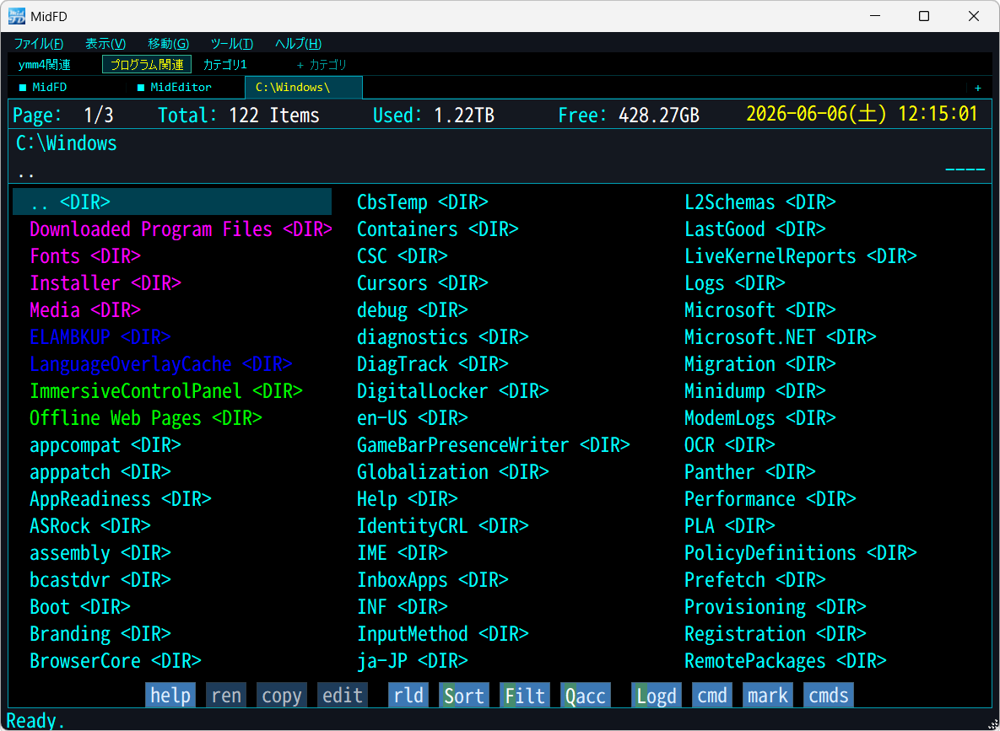
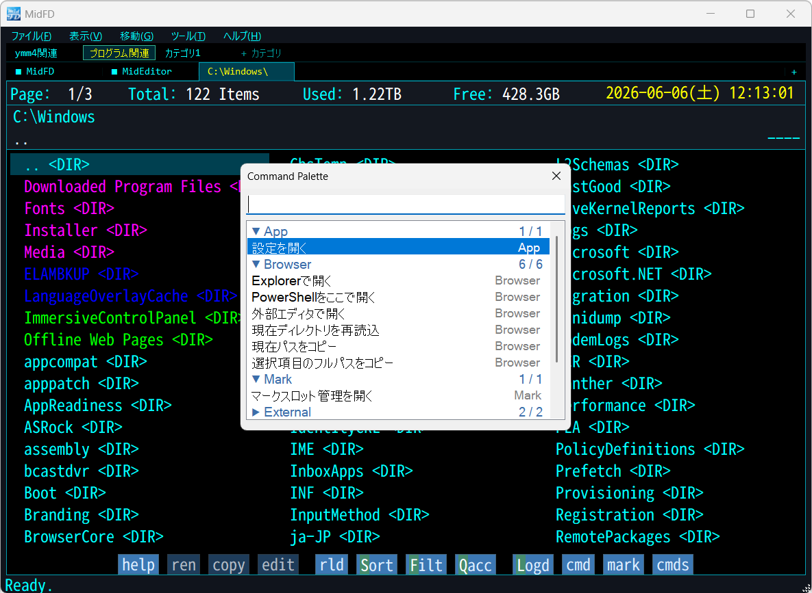
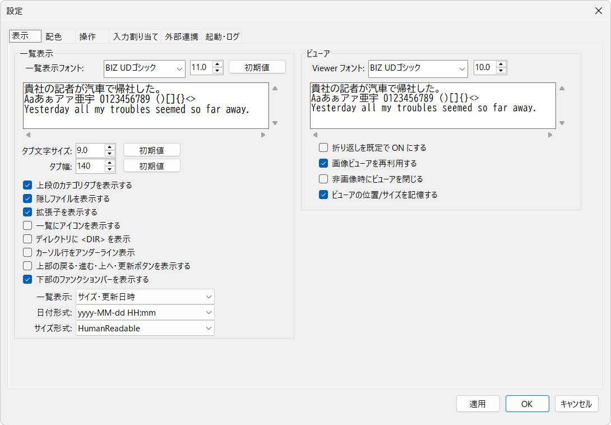
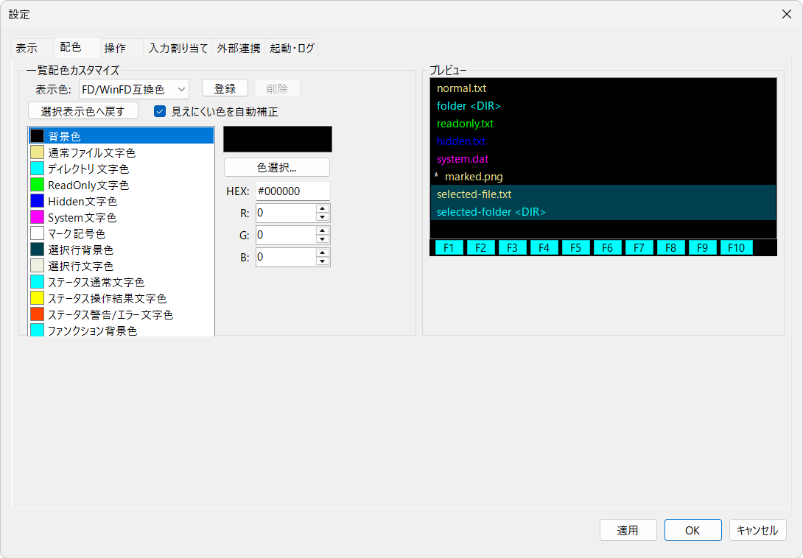
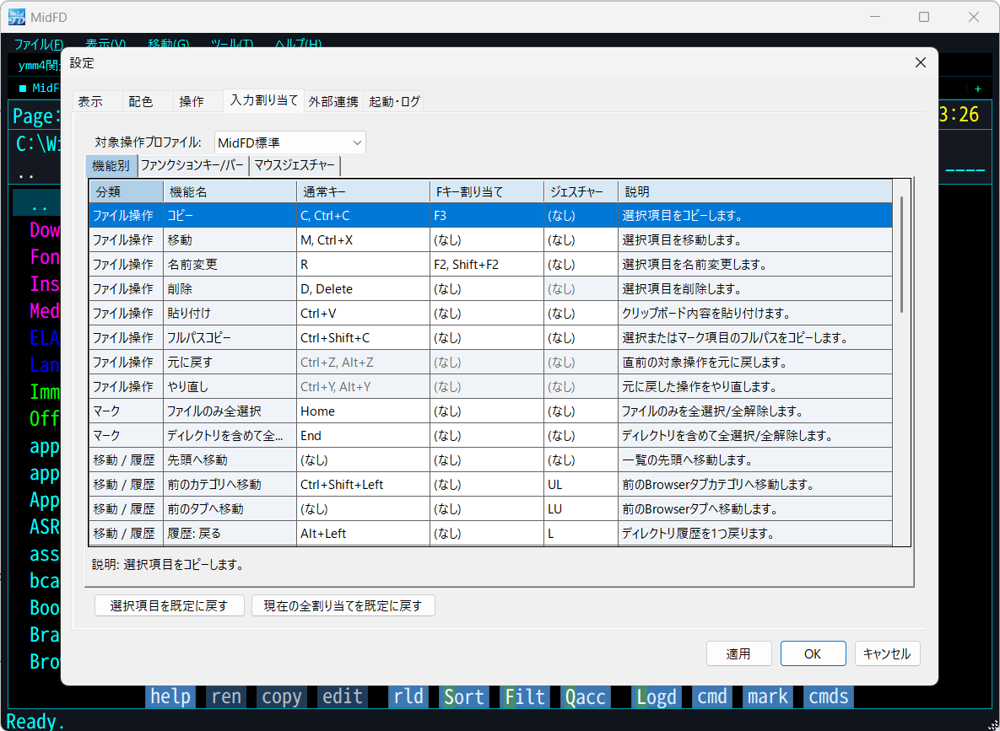
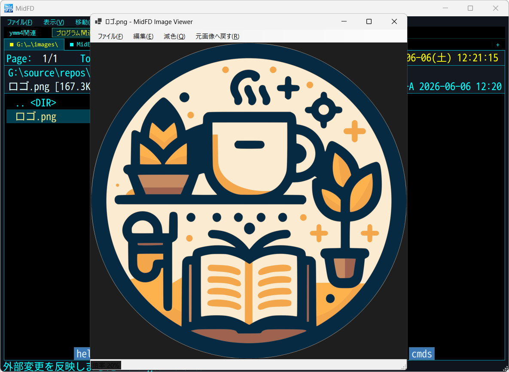

# MidFD

MidFD は、FDライクな操作感を参考にしつつ、現在の Windows 環境向けに設計した軽量ファイラーです。

キーボード中心のファイル操作、タブとカテゴリ、Mark／MarkSlot、QuickAccess、内蔵Viewer、7-Zip連携、外部ツール起動などを備えています。オリジナルの FD との完全互換を目的としたものではなく、現代的な操作導線とFD／WinFD風のキー配置を選べる独自アプリケーションです。

## ダウンロード

通常利用する場合は、GitHub Releases の実行用パッケージを使用してください。

- [MidFD-win-x64.zip](https://github.com/tk999jp/MidFD/releases/latest/download/MidFD-win-x64.zip)

ZIPを展開し、`MidFD.exe` を実行します。

> [!IMPORTANT]
> GitHub の `Code > Download ZIP` や `Source code (zip)` はソースコードです。通常利用向けの実行パッケージではありません。

## 動作要件

- Windows 10 / 11 64bit
- .NET 10.0 Desktop Runtime x64

起動できない場合は、配布ZIP直下の `README_FIRST.txt` を参照してください。

MidFDには次の外部ツールを同梱していません。必要な機能だけ別途用意できます。

- 7-Zip: 圧縮・解凍
- ffmpeg: 動画の静止画プレビュー
- ffprobe: 動画情報・再生時間取得
- ffplay: 動画・音声の外部再生
- 任意の外部エディタ

## スクリーンショット

### メイン画面



### Command Palette



### 表示・タブ設定



### 配色設定



### 操作カスタマイズ



### 画像ビューア



## 主な機能

### Browser・移動

- タブとカテゴリによる作業場所の整理
- QuickAccess、履歴、Logdskによるディレクトリ移動
- パンくず表示と直接パス入力の切り替え
- `%TEMP%` などの環境変数を含むパス入力
- ローカルドライブとUNCパスの容量表示
- ファイル名のみ／サイズ／サイズ＋更新日時の表示切り替え
- Bytes、KB／MB、人間向け形式のサイズ表示

### ファイル操作

- コピー、移動、削除、名前変更、新規ファイル・フォルダ作成
- 同名ディレクトリのマージと異なるドライブ間の移動
- symlink／junctionをリンク先へ再帰せず、リンク自体として扱うコピー・移動
- リンク作成時だけ権限昇格する補助プログラム
- 操作後も実体が残るMarkを維持
- MidFD管理ゴミ箱による退避、復元、完全削除、保持期限管理

### Mark・MarkSlot

- Space／Insert、範囲選択、全選択によるMark
- 大量フォルダでも表示ページ外を含めた一括Mark
- MarkSlotへの保存・復元
- MarkSlot通常画面と管理画面の分離

### 圧縮・Drag ZIP

- 7-ZipとWindows標準機能を利用した圧縮・解凍
- 通常の圧縮画面を「自動」「7-Zip標準Dialog」「MidFD簡易Dialog」から選択
- 自動モードでは7-Zip標準Dialogを優先し、利用できない場合はMidFD簡易Dialogへfallback
- Browserの項目または空白部分から、現在MarkをZIP化して外部アプリへ渡すDrag ZIP
- 必要に応じて対象一覧manifestをZIPへ同梱

### Viewer・外部ツール

- テキスト、画像、SVG、Markdown、SQLiteのread-only preview
- UTF-16 LE／BEを含むテキストpreviewとbinary判定
- 大きなテキストファイル向けLargeText Viewer
- 画像の矩形選択コピー、回転、反転、画像情報表示
- ffmpegを利用した動画静止画プレビュー
- ffplayまたはWindows関連付けによるメディア外部再生
- PowerShell、コマンドプロンプト、Explorer、外部エディタ、登録済み外部ツールの起動
- Command Paletteによる機能・設定・外部ツール検索

### 設定

- SQLite (`Data\Settings\settings.db`) による設定保存
- 設定のエクスポート／インポート
- backupからの復旧と、破損時の既定値起動
- 最大5世代のstandalone backup
- Browserキーバインド、Functionバー、マウスジェスチャーのカスタマイズ
- 配色プリセットとユーザー配色プリセット

## 初回セットアップ

初回起動時に「MidFD 初回セットアップ」を表示します。後から設定画面の「起動・ログ」から「MidFD 基本セットアップ」として再表示できます。

### 機能範囲

| 選択 | 主な内容 |
|---|---|
| 基本機能のみ | ファイル閲覧、コピー、移動、名前変更、Mark、標準キー操作、内蔵Viewer |
| 便利機能まで使う（推奨） | 基本機能＋前回状態復元、マウスジェスチャー、Functionバー説明、メディアEnter外部再生、パンくず表示 |
| すべての機能を使う | 便利機能＋MidFD管理ゴミ箱、Drag ZIP、manifest、クリップボードのテキスト貼り付け |

各項目は個別に変更できます。既知の組み合わせと一致しない場合は「個別設定」として扱われます。

### 操作方式

- MidFD標準
- FD／WinFD互換

操作方式を実際に切り替えたときは、対応する標準配色へ連動します。その後、配色は自由に変更できます。保存済みの独自配色は、セットアップ画面を開いただけでは上書きされません。

### 外部アプリ

7-Zip、動画ツール、外部エディタを指定できます。未設定でも基本操作は可能で、自動検出または既存fallbackを使用します。

詳しくは [UserDocs/PROFILES.md](UserDocs/PROFILES.md) を参照してください。

## 最初に覚えるキー

| 操作 | キー |
|---|---|
| 開く／表示 | Enter |
| OSの関連付けで開く | Z |
| コマンド実行 | X |
| PowerShell | H |
| コマンドプロンプト | Shift+H |
| パス入力 | Ctrl+L |
| QuickAccess | Q |
| Logdsk | L |
| MarkSlot | Ctrl+M |
| 圧縮／解凍 | P / U |
| 設定 | O |
| Command Palette | Ctrl+Shift+P |

詳しいキー操作は [UserDocs/KEYBINDINGS.md](UserDocs/KEYBINDINGS.md) を参照してください。

## ドキュメント

| ファイル | 内容 |
|---|---|
| [UserDocs/USER_GUIDE.md](UserDocs/USER_GUIDE.md) | 基本操作と主要機能 |
| [UserDocs/PROFILES.md](UserDocs/PROFILES.md) | 機能範囲、操作方式、配色、外部アプリ |
| [UserDocs/KEYBINDINGS.md](UserDocs/KEYBINDINGS.md) | キーバインド一覧 |
| [UserDocs/BUILD.md](UserDocs/BUILD.md) | ビルド方法 |
| [UserDocs/SUPPORT.md](UserDocs/SUPPORT.md) | 不具合報告・サポート方針 |
| [CHANGELOG.md](CHANGELOG.md) | 利用者向け更新履歴 |

## 重要な注意・免責

MidFDはファイルのコピー、移動、削除、名前変更、アーカイブ操作などを行います。重要なファイルを扱う前に、必要なbackupを用意してください。

本ソフトウェアは無保証で提供されます。本ソフトウェアの使用または使用不能によって発生した損害について、開発者は責任を負わず、個別の復旧や補償を保証しません。内容を理解したうえで利用してください。

## ビルド

MidFDは .NET 10／Windows Formsアプリケーションです。

```powershell
dotnet build .\MidFD.csproj
```

詳しくは [UserDocs/BUILD.md](UserDocs/BUILD.md) を参照してください。

## バージョン表記

日付ベースのversionを使用します。

- `vYYYY.MM.DD`
- 必要に応じて `vYYYY.MM.DD.N`

アプリのversion情報には、release versionとbuild元commitを含めます。不具合報告時は、GitHub Releaseのversionとアプリ内versionを併記してください。

## 不具合報告・要望

GitHub Issuesから報告してください。可能な範囲で次を添えてください。

- MidFDのversion
- Windowsのversion
- 機能範囲と操作方式
- 操作手順
- 期待した結果と実際の結果
- エラーメッセージ、スクリーンショット

詳しくは [UserDocs/SUPPORT.md](UserDocs/SUPPORT.md) を参照してください。

## 作者と関連チャンネル

MidFDは個人開発ソフトウェアであり、作者の活動を応援していただく「チャンネル応援ウェア」としても公開しています。チャンネル登録は利用条件ではありません。

- [よろずごとゆっくり解説](https://www.youtube.com/@ch-tk)
- [小さな物語の停車駅](https://www.youtube.com/@ch-tk_station)

チャンネルはMidFDの正式なサポート窓口ではありません。

## ライセンス

Apache License 2.0で公開しています。詳細は [LICENSE](LICENSE) を参照してください。
